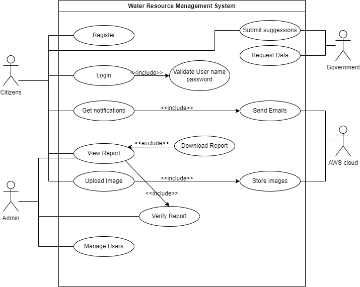

# 🌊 Water Quality Management System (WRMS)

## 📌 Project Overview
The **Water Quality Management System (WRMS)** is a **web-based application** designed to help **communities monitor water quality** using **crowd-sourced images**. The system **analyzes water clarity, pollution levels, and potential health risks** by leveraging **Digital Image Processing (DIP)** and **cloud-based data storage**.

## 🚀 Key Features
- **📸 Image Upload & Analysis**: Users upload images of water bodies, which are analyzed for turbidity and pollution.
- **🌍 Geotagging & Location-Based Reports**: Uses **Google Maps API** to track water quality changes.
- **📊 Data Visualization**: Interactive dashboards with **real-time charts** and reports.
- **🔔 Notifications**: Automated **email/SMS reminders** for users to submit images regularly.
- **📄 Report Generation**: Generates **downloadable water quality reports (PDF format)**.
- **🔐 Secure User Authentication**: Uses **JWT-based login system**.

## 🎯 Target Users
- **Local Citizens**: Report and track water quality in their area.
- **Government Officials**: Monitor pollution levels for environmental planning.
- **Researchers & Scientists**: Use water quality data for research and analysis.

## 🛠️ Tech Stack
### **Frontend**
- **React.js** (with Tailwind CSS)
- **Google Maps API** (for geotagging and mapping)

### **Backend**
- **Node.js** (Express.js framework)
- **MongoDB** (Cloud-based database via MongoDB Atlas)

### **Cloud Services**
- **AWS S3** (Image storage)
- **AWS SES & Twilio** (Email & SMS notifications)
- **AWS Lambda** (Image analysis processing)
- **OpenCV.js** (Digital Image Processing for pollution/turbidity detection)

## 📌 System Architecture
The system follows a **MERN stack architecture** integrated with **cloud-based services**:
```
User → React.js Frontend → Express.js API → MongoDB (Data) / AWS S3 (Images) / OpenCV.js (Analysis)
```
## Use Case Diagram


## 🛠️ Installation & Setup
### **1️⃣ Clone the Repository**
```sh
git clone https://github.com/your-repo/water-quality-management-system.git
cd water-quality-management-system
```

### **2️⃣ Install Dependencies**
```sh
# Install backend dependencies
cd backend
npm install

# Install frontend dependencies
cd ../frontend
npm install
```

### **3️⃣ Environment Variables**
Create a `.env` file in the **backend** directory with:
```env
MONGO_URI=your_mongodb_connection_string
AWS_ACCESS_KEY=your_aws_access_key
AWS_SECRET_KEY=your_aws_secret_key
JWT_SECRET=your_jwt_secret_key
GOOGLE_MAPS_API_KEY=your_google_maps_api_key
```

### **4️⃣ Run the Application**
```sh
# Start Backend Server
cd backend
npm start

# Start Frontend
cd ../frontend
npm start
```

## 📊 Functional Modules
- **User Authentication** (JWT-secured)
- **Image Upload & Storage** (AWS S3)
- **Image Analysis** (Turbidity & Pollution Detection)
- **Location-Based Comparison** (Google Maps API)
- **Notifications** (AWS SES for emails, Twilio for SMS)
- **Report Generation** (PDF reports)

## 🔐 Security Measures
- **JWT Authentication** for secure user login.
- **AWS IAM Roles** for controlling access to AWS S3.
- **Bcrypt Hashing** for password security.

## 🛠️ System Requirements
- **Node.js** (>=14.x)
- **MongoDB Atlas** (Cloud-based)
- **AWS Services** (S3, SES, Lambda)
- **React.js** (Latest version)

## 📄 License
This project is **open-source** under the **MIT License**.

## 🤝 Contributors
- **Nuwani Sandamali**
- **Tharindu Ruwanpathirana**

For any questions, please contact **[s20510@sci.pdn.ac.lk](mailto:s20510@sci.pdn.ac.lk)**,**[ruwanpathiranatc.20@uom.lk](mailto:ruwanpathiranatc.20@uom.lk)**.
